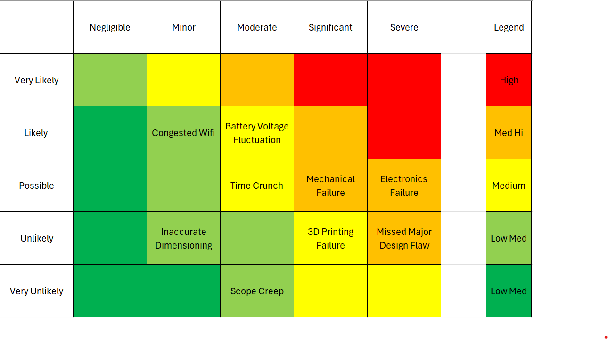

# Health and Safety Considerations

## General Safety
1. 
2. 

## Components
1. Batteries
2. 

## Prototype Fabrication
1. 3D Printing Fumes
2. MDF Particles

## Mitigation Action
### 

# Risk Management
1. Scope creep - losing sight of the original plan as the weeks progress and overcomplicating the design

2. Time crunch - due to a limited amount of time, the design execution is subpar and many original ideas are scrapped

3. Electronics Failure Raspberry Pi Pico getting shorted - due to poor wiring techniques or poor electrical parts, the motors may be unable to work or the Raspberry Pi Pico is shorted and unable to function

4. 3D Printing Failure/Wasting print volume - due to failures during 3D printed, large amounts of filament may be wasted which would make it difficult for an updated design to follow the 3D printing amount regulations

5. Mechanical failure - once part has been 3D printed, it is determined that the part doesn't function as well or the part breaks which means it needs to be printed again

6. Inaccurate dimensioning - due to poor dimensioning, parts of the robot cannot be integrated properly or do not meet the requirements to complete the competition objectives

7. Congested Wifi - since multiple groups will be using the same WiFi and will be controlling their robot through WiFi protocols, issues related to WiFi congestion are possible

8. Major design remodelling after testing - after testing has been done, our design ideas do not work and it is required we u
m a ogre

9. Battery Voltage Fluctuation

### Risk Matrix

| Risk              | Response Plan |
| :---------------- |  :----: |
|  Risk 1       |   True   | 
