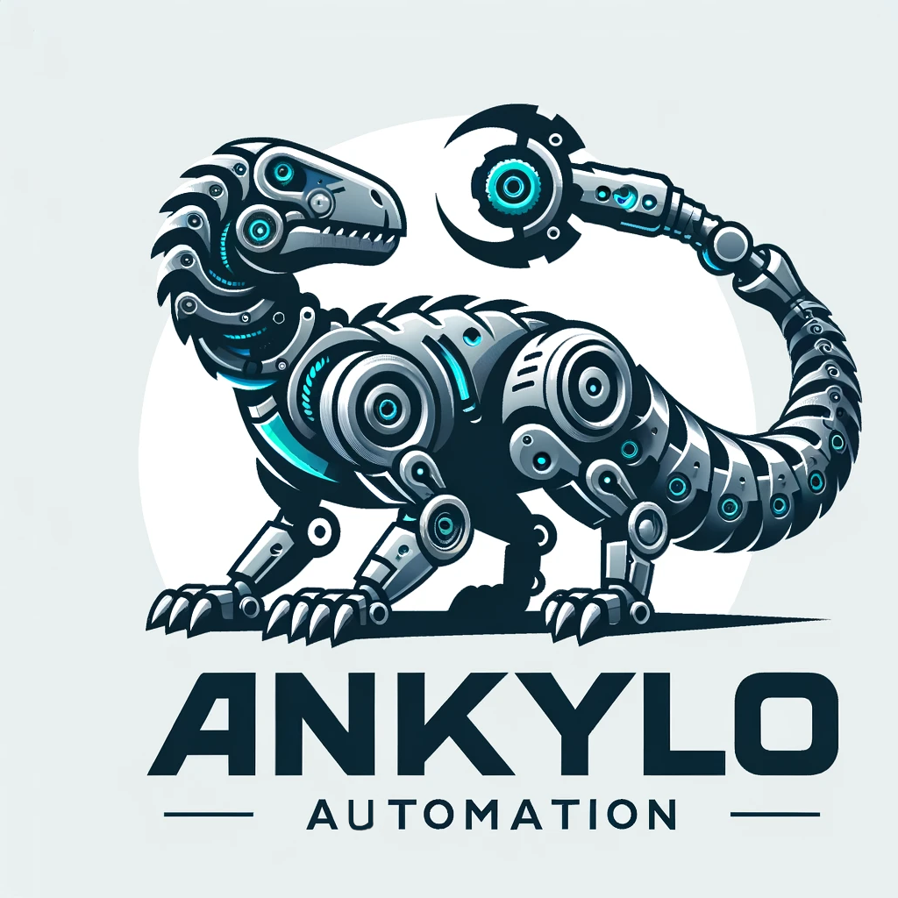
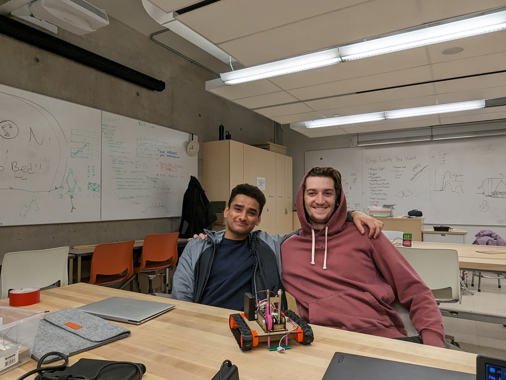
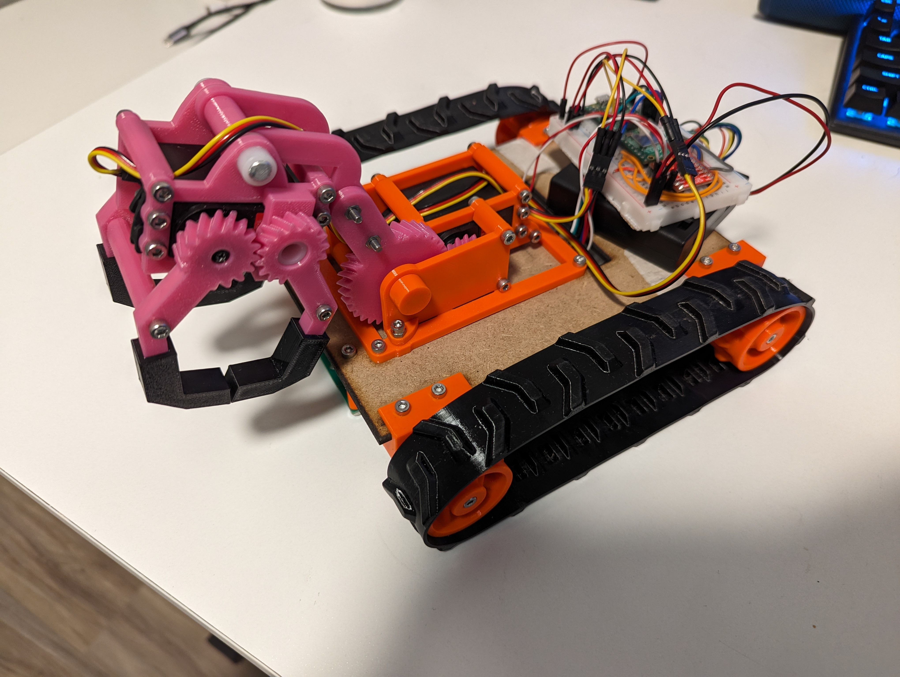

# Section002_Group9_AnkyloAutomation

## Team Members
- Callum
- Mustafa

## Overall Strategy
- Autonomous Mode: Line following 
- Manual Mode Priority: 
  1. Rescue Ken
  2. Collect dinosaurs

## Index
### Rounds
- [Round 1](rounds/Round%201/)
- [Round 2](rounds/Round%202/)
- [Round 3](rounds/Round%203/)
- [Round 4](rounds/Round%204/)
- [Round 5](rounds/Round%205/)

### Resources
- [Code](code)
- [3D Printing](design_files/3D_printing/)
- [Laser Cutting](design_files/laser_cutting/)
- [CAD](design_files/CAD/)
- [Prototype](prototype)
