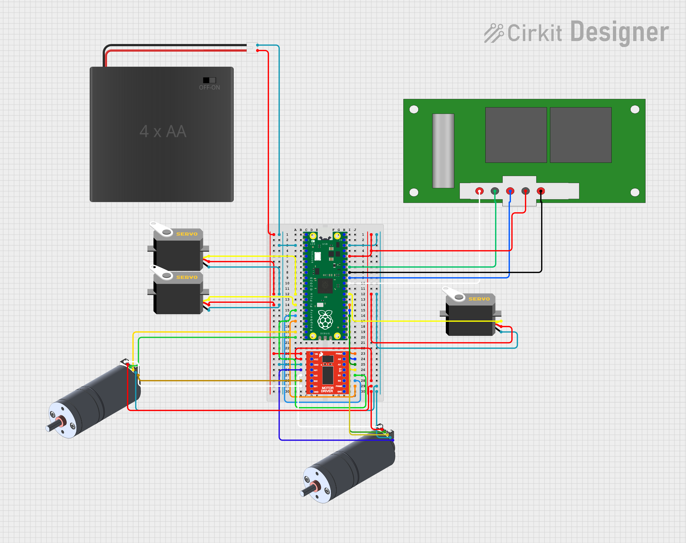
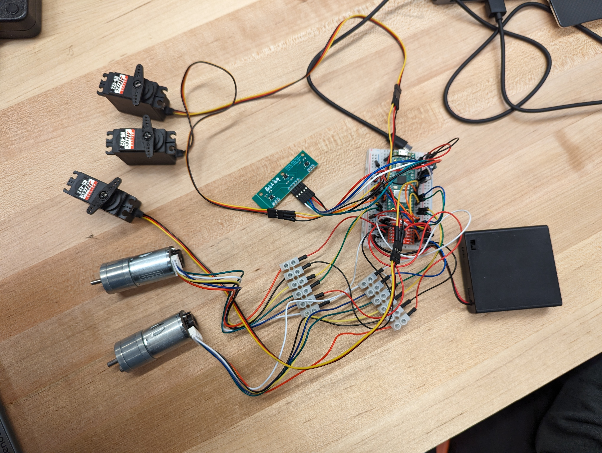

# Workshop 6.1 Electical Schematic and Power Budgeting

## Design Round 3 Scrum Planning

### What are the specific goals for this round? Aside from meeting this round’s design review deliverables, what are your own goals?
finish

### What are the backlog items from last round?
As of right now, we need to start integrating the controller with the DC motors, finsh up CAD modelling the design and create a more accurate 2D diagram of the board.

### What are the tasks needed to achieve each goal, including the backlog items?
1. Integrate DC motors with controller - Mustafa
2. Create accurate 2D model of the compeition board - Callum
3. Fine Tune PID loop for DC motor - Mustafa
4. Complete Chassis 3D model and begin arm - Callum

## Electrical Schematic

## Power Budgeting
finish
add battery life

## 3D printing tally

| Part | Volume | Percent |
|-----------------|-----------------|---------|
| Left Tread | 1.68 in3  | 11.2 % |
| Right Tread | 1.68 in3 | 11.2 % |
| Wheels | 2.25 in3| 15 %|
| Total | 5.61 in3| 37.4 %|

modified from this design https://www.thingiverse.com/thing:430305

# Workshop 6.2 Mechanical Module Assembly

# Mechanical Module

The mechanical module is the 

# Workshop 7.1 Module Integration

## Integrated Module

finish
talk about

## Team Health Assessment and Peer Feedback
finish
summarize discussions

