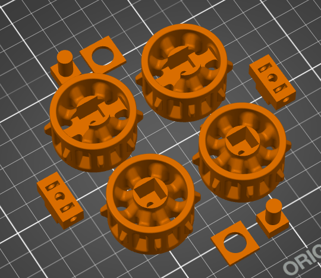
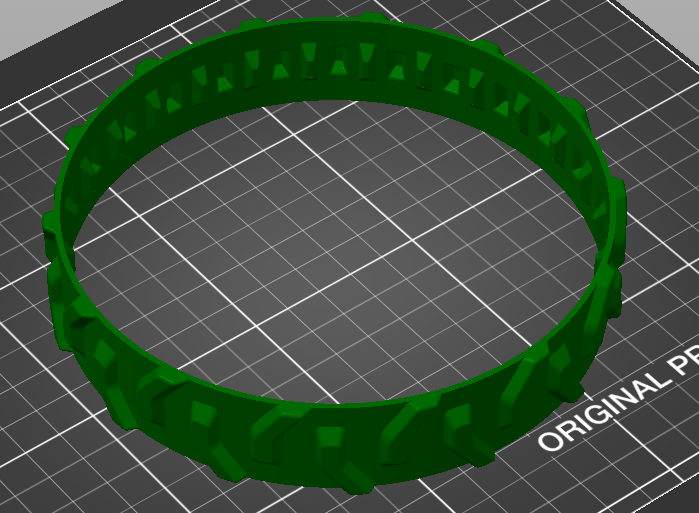

# Workshop 6.1 Electical Schematic and Power Budgeting

## Design Round 3 Scrum Planning

### What are the specific goals for this round? Aside from meeting this round’s design review deliverables, what are your own goals?
Our primary goal is completing the CAD for the chassis design for laser cutting as well as starting with arm/gripper design. As well as determining the material types that will be used for the arm/gripper. Another goal is fine tuning our PID control for the DC motor with the wheels now attached. Another goal is too get DC motor control working with the remote control, as well as finalizing the button mapping for the robot.

### What are the backlog items from last round?
As of right now, we need to start integrating the controller with the DC motors, finsh up CAD modelling the design and create a more accurate 2D diagram of the board.

### What are the tasks needed to achieve each goal, including the backlog items?
1. Integrate DC motors with controller - Mustafa
2. Create accurate 2D model of the compeition board - Callum
3. Fine Tune PID loop for DC motor - Mustafa
4. Complete Chassis 3D model and begin arm/gripper - Callum
5. Material choice for arm/gripper - Callum and Mustafa
6. Finalize button mapping - Callum and Mustafa

## Electrical Schematic
Electrical Schematic made using Cirkit Designer

## Power Budgeting
| Component | Voltage (V) | Current Draw (A) | Power (W) | Source |
|-----------|---------|--------------|-----------|--------|
| DC Motor w/Encoder | 6 | 0.13 (3.2) | 0.78(19.2) | https://www.dfrobot.com/product-1617.html
| DC Motor w/Encoder | 6 | 0.13 (3.2) | 0.78(19.2) | https://www.dfrobot.com/product-1617.html
| TB6612FNG | 3.3 | 0.0011 (0.0018) | 3.63 (5.94) | https://www.sparkfun.com/datasheets/Robotics/TB6612FNG.pdf
| Hitec HS-422 | 6 | 0.008 (0.15) | 0.048 (0.9)| https://cdn.robotshop.com/media/h/hit/rb-hit-27/pdf/hs422-31422s.pdf
| Hitec HS-422 | 6 | 0.008 (0.15) | 0.048 (0.9)| https://cdn.robotshop.com/media/h/hit/rb-hit-27/pdf/hs422-31422s.pdf
| Hitec HS-422 | 6 | 0.008 (0.15) | 0.048 (0.9)| https://cdn.robotshop.com/media/h/hit/rb-hit-27/pdf/hs422-31422s.pdf
| Line Follower | 3.3 | 0.075 | 0.2475 | https://cdn.robotshop.com/media/g/gtd/rb-gtd-02/pdf/linefollowerdatasheet.pdf
| Pi Pico | 5 | 0.05 (0.15) | 0.25 (0.75) | https://datasheets.raspberrypi.com/picow/pico-w-datasheet.pdf?_gl=1\*11bp2lj*_ga\*NzU5OTYyNDQzLjE3MDg5NjQ1NjM.\*_ga_22FD70LWDS*MTcwODk2NDU3MC4xLjAuMTcwODk2NDU3MC4wLjAuMA.. https://lastminuteengineers.com/getting-started-with-raspberry-pi-pico-w/#:~:text=On%20the%20board%2C%20there%20is,Pico%20W%20consumes%20about%2050mA.
| Total || 0.4101 (7.0768) | 5.8315 (48.0375) |

| Battery | Voltage (V) | Capacity (mAh) | Source
|------|--------|---------|---
| Nickel Metal Hydride Battery | 1.2V | 2500 | https://www.duracell.com/wp-content/uploads/2018/12/AA2500HP-PREMIUM-v1.0.pdf

We have 4 batteries therefore they have a combined capacity fo 10 Ah.

Low End: $\frac{10}{0.4101}= 24.38 h $

Peak: $\frac{10}{7.0768}= 1.41 h $

Therefore the battery will last 1.41 to 24.38 hours.

## 3D printing tally

| Part | Volume | Percent |
|------|--------|---------|
| Left Tread | 1.68 in3  | 11.2 % |
| Right Tread | 1.68 in3 | 11.2 % |
| Wheels | 2.25 in3| 15 %|
| Total | 5.61 in3| 37.4 %|

modified from this design https://www.thingiverse.com/thing:430305

# Workshop 6.2 Mechanical Module Assembly

# Mechanical Module

The mechanical module is a modified wheel and tread system from a thingiverse model referenced above. The design improves the connection and modularity of the wheel design, this ensures the wheels are securly attached. The modularity is benefitial as if one piece breaks the entire wheel does not need to be reprinted. The inner core of the drive wheel has 3 embededd nuts 2 for attaching to the motor shaft and one for connected the core to the wheel. The idle wheel on the other hand has a core that a nylon sleeve can be press fit in to allow for smoother rotation and an embeeded nut to attach the core to the wheel. These were 3D printed with PETG which is supperior to PLA in strength. Another part of this module is a set of 2 TPU treads which will be attach to the drive wheel and idle wheel. TPU is flexible which allows the treads to be printed in one piece simplifing the design and reliability of print comapred to printing treads in PETG or PLA.

# Workshop 7.1 Module Integration

## Integrated Module

The core of the wheel is removable and is attached to the DC motor first, it is design with 2 embedded nuts on both sides to give a secured attachement to the D shaped DC motor shaft. Once the core is attached you can attach the wheel with a screw going into another embedded nut. The purpose of this integrated module is to be what controls the movement of the tread system for the robot. It functions well so far staying securely attached to the motor while spinning and once we have the chassis laser cut we can do futher testing on reliability of the tread system.

## Team Health Assessment and Peer Feedback

### Team Dynamics
Our discussion focusing on the low scores for goal progression and healthy fact-driven, centered around the necessity for setting clear and measurable objectives to ensure completion of the project in the given time. We also touched on clear communication voice different opinions on how to move forward onto new tasks or to complete current ones. The teams will use the in class milestones has checkups as well as creating our own check-ins to monitor progess thoughout the rest of the project.

### Peer Feedback
