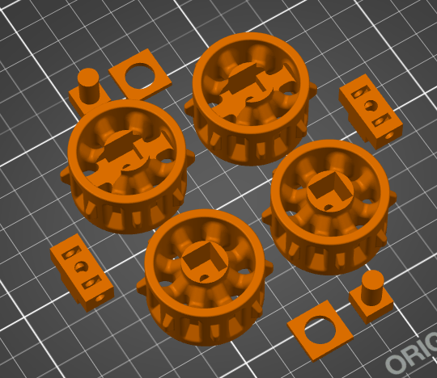
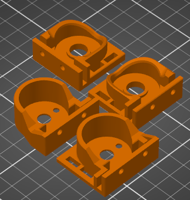
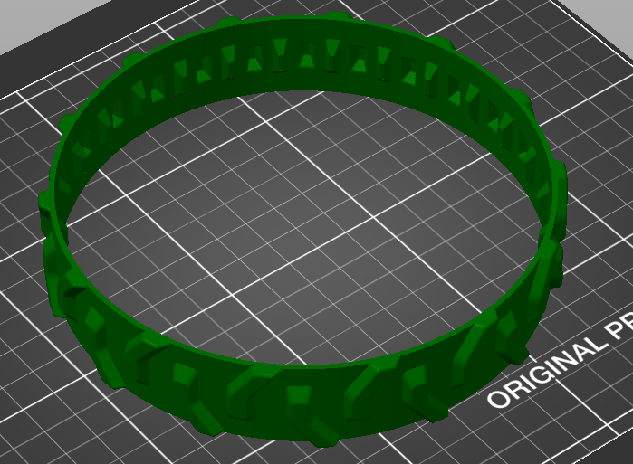

[Home](main)

# 3D Printing Tally
| Part | Volume | Percent |
|------|--------|---------|
| Treads (x2) | 3.36 in3  | 22.4 % |
| Wheels | 2.25 in3| 15 %|
| Mounts | 1.13 in3| 7.5 % |
| Total | 5.61 in3| 44.9 %|

treads and wheels modified from this design: https://www.thingiverse.com/thing:430305.

# Pictures
## Wheels

## Mounts

## Treads

## Line Following Mounts V1
To be added

## Line Following Mounts V2
To be added

## Arm V2
To be added

## Gripper
To be added