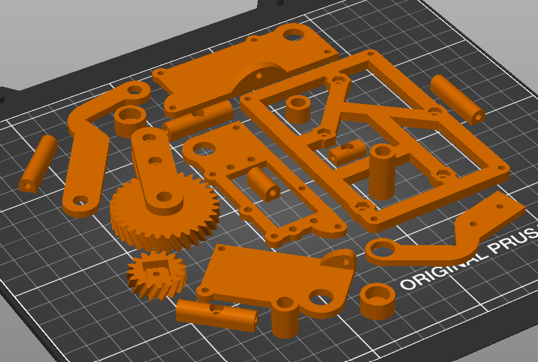

[Home](main)

# 3D Printing Tally
| Part | Volume | Percent |
|------|--------|---------|
| Treads (x2) | 3.36 in3  | 22.4 % |
| Wheels | 2.25 in3| 15 %|
| Mounts | 1.13 in3| 7.5 % |
| Idle Wheel Shafts V2 | 0.16 in3| 1.07 % |
| LFM V1 | 0.07 in3| 0.47 % |
| LFM V2 | 0.08 in3| 0.53 % |
| Arm V2 | 2.84 in3| 18.93 % |
| Claw | 1.39 in3| 9.27 % |
| Idle Claw Pincers V2 | 0.26 in3| 1.73 % |
| TPU Sleeve | 0.59 in3| 3.93 % |
| Total | 12.13 in3| 80.87 %|

treads and wheels modified from this design: https://www.thingiverse.com/thing:430305.

# Pictures
## Wheels

## Mounts

## Treads

## Idle Wheel Shafts V2

## Line Following Mounts V1

## Line Following Mounts V2

## Arm V2

## Claw

## Idle Claw Pincers V2

## TPU Sleeve
