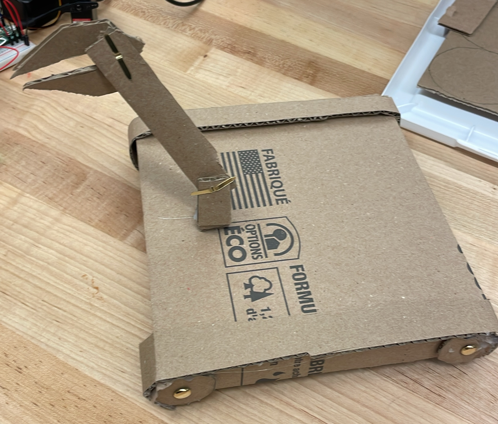

[Home](main)
# Design Round 1 Scrum Planning
## Specific Goals
1. Create a detailed and scaled drawing of our inital design. This will provide us with  a better understanding of how to 3D model it. 
2. Start coding with the servo and DC motors. Start to work with them and understand the capabilities of the motors
3. Begin planning, 3D modelling and printing a preliminary design we can use to start integrating parts and test our inital design idea

## Tasks
1. Detailed & scaled drawing:
    a. take accurate measurements of the competition board
    b. sketch inital designs, keeping in mind where all the parts would go 
    c. plan out the dimensions for each part of the design

2. Testing & integrating motors:
    a. code and test the servomotor individually. Write code to test the motor under different circumstances e.x clockwise, counterclockwise, varying speeds 
    b. code and test the DC motor individually. Write code to test the motor under different circumstances e.x clockwise, counterclockwise, varying speeds
    c. create functions that handle each motor e.x sending speed and direction parameters to a DC motor function will operate the motor as-per the parameters

3. 3D Model & printing preliminary design 
    a. based on the detailed drawing, create a 3D CAD model
    b. research which filaments to use on each part of the design e.x tank treads could be TPU while the chasis could be PLA 
    c. start printing the model and integrate the design once the model has been 3D printed

## Responsibilities
### Mustafa
1. Create a 2D drawing of the competition board with accurate dimensions and notes on obstacles and potential design considerations
2. Start wiring, researching and coding motors with the Raspberry Pi Pico
3. Work with Callum on the design of the robot, giving opinions and advice about the layout of components and robot's functions

### Callum
1. Create rough 2D sketch in OneNote to get started on the design of the robot
2. Iterate upon sketch and implement proper dimensioning. Convene with Mustafa to brainstorm functions, ideas and components related to the robot
3. Begin 3D modelling and printing components for further testing and integration

# Cardboard Design Documentation 
During the cardboard design workshop, we created a model of our entire design. We highlighted the joints we would use for the arm using pins. This allowed us to see the mobility that the arm would likely have. Also, we designed the wheels and frame of our design as well, giving us a better picture for how the sizing and shape of the robot would look like. We chose to use tank treads to ensure the wheels would operate synchronously and made the robot have a square to allow for easy mobility. 

### What did you set out to do?
To maken a minimum viable protype using cardboard, allowing us to gain a rough undertsanding of the size, shape, dimensions and mechanisms used for our robot. The protype will allow us to start 3D modelling in CAD with a point of reference. 

### What did you learn from your prototype?
We learned the scale of our robot and its size relative to the board. We also gained an understanding of the gernal layout of all the components and how the design will look like. 

### What changes do you propose based on these insights?
From our cardboard protype, we learned that it may be better to scale down the size of the robot. The square will allow for better mobility when driving in manual mode but as of right now, the clearance of the robot compared to doors is quite low. This would make it more difficult for the robot to exit the gate during autonomous mode. 

## Resources
- [3D Printing](../../design_files/3D_printing/)
- [Laser Cutting](../../design_files/laser_cutting/)
- [CAD](../../design_files/CAD)
- [Code](../../code/)