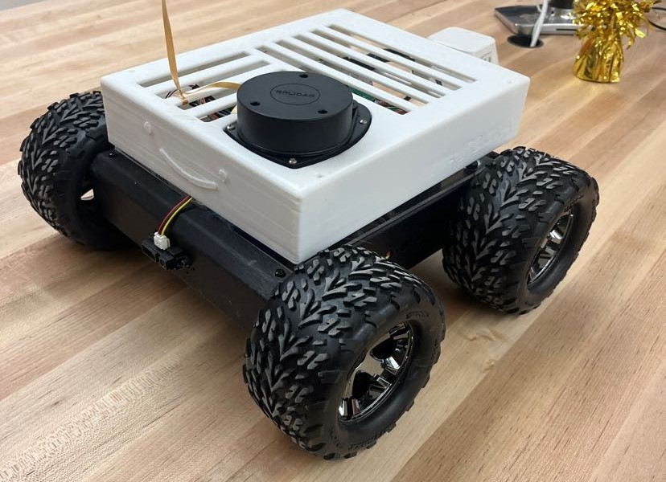
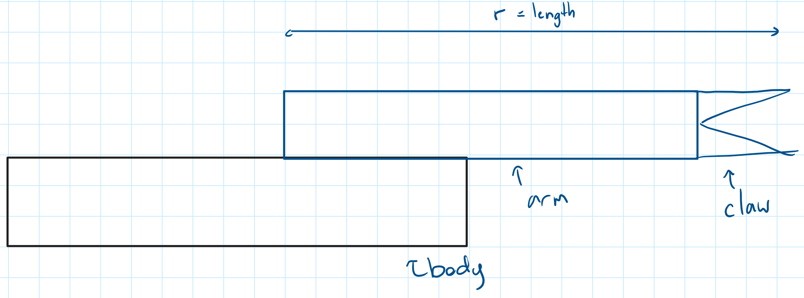

## Design on Paper

We are happy with our ideas
- Instrinct:

- Analytical:

| Idea | Risk|
| :---------------- |  :----: |
| Pulleyed Wrist and flexible claws (made from TPU) | High, may needs lots of prototyping |
|Tank Treads | Low, simple design should involve little prototyping |
| Vertical rotation in arm to guide arm towards dinosaurs placed on rocks | Medium, needs protypin but less then pulleyed writs |

# Exploring Tank Treads

Within the 3d printing community there are many prior arts to tank tread design for small scale robotics. The design of the treads is usually in TPU or made of many linkages of a harder plastic. A shortcoming of the harder plastics is that you must assemble the treads one linkage at a time. Using TPU in our design means we can print the treads in one solid piece, create our own tread pattern to increase friction on the game board.

# Back of Envelope Calculations: Shoulder Rotation

## Values
| Assumption | Value|
| :---------------- |  :----: |
| Weight of Arm |   Negligible |
| Wight of Gripper | 30 g |
| Theta | $\pi \over 2$ degrees|
| Gravity | 9.81 $m\over s^2$|
| Weight of Dinasuar |   0.1 kg (double check)  |
| Weight of Barbie |   0.2 kg  |

| Constant | Value|
| :---------------- |  :----: |
| Torque Provided from motor |   0.402 Nm  |

### Force Calculation
$$ F = mg = 0.205*9.81$$
$$ F = 1.962 N $$

### Torque Calculation at 15 cm
$$ \tau = rF  $$
$$  \frac{\tau}{F}   = r    $$
$$ r =  \frac{0.4 Nm}{1.962N}  $$
$$ r = 0.2028m = 20.38cm $$

This calcualtion shows that the max length of the linkage to pick up a the ken doll, which is heavier then the dinasars, is 20.38cm.
