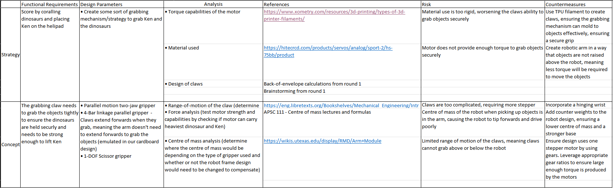
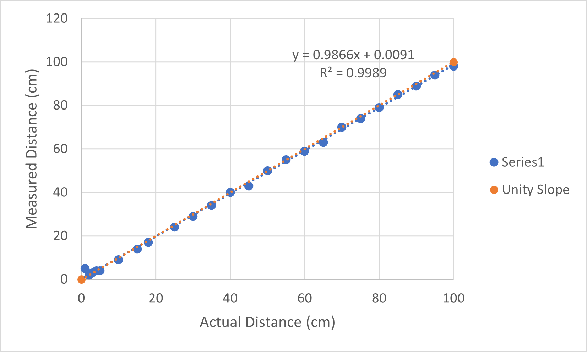

[Home](../../)
# Design Round 2 Scrum Planning Answers 

### What are the specific goals for this round? Aside from meeting this round’s design review deliverables, what are your own goals?
A major goal for us is to start working on PID control for the DC motors, ensuring that the motors respond accordingly to external disturbances and can adapt on-the-fly. Another major goal prior to prototyping for us to complete is to determine what the parts of the robot will be made out of. This is very crucial to determine so we do not waste filament and MDF board. Lastly, once the part materials have been determined, it would be ideal for us to start 3D printing, ensuring we are operating a good pace to finish the design.  

### What are the backlog items from last round?
As of right now, we need to start integrating the controller with the DC motors, finsh up CAD modelling the design and create a more accurate 2D diagram of the board.

### What are the tasks needed to achieve each goal, including the backlog items?
1. Verify ultrasonic sensors - Callum 
2. Get DC motor running - Mustafa
3. Run servomotor 0-180 degrees - Mustafa
4. Create PID loop for DC motors - Mustafa
5. Integrate DC motors with controller - Mustafa
6. Determine materials for each part of the design - Callum
7. Continue CAD modelling design and start 3D printing - Callum 
8. Create accurate 2D model of the compeition board - Callum

# Health and Safety Considerations
1. We reviewed the plan at the beginning of Round 2
2. As of right now, we are meeting the goals described in our meeting plan and don't for-see situations where we won't be able to meet these goals 
3. We have not made any changes
4. We are currently meeting all aspects of the plan

# FRDPARC Table 

# Ultrasonic Sensor

| Data Point  |Actual distance (cm)  |       Measured distance (cm)         |  Slope        |  R^2    |       
|----------------------|------------------------|---------------------|-----------|---------|
| 1                    | 1                      | 5                   |      y = 0.9866x + 0.0091     |R² = 0.9989|
| 2                    | 2                      |  2                   |           |         |
| 3                    | 3                      |   3                  |           |         |
| 4                    | 4                      |    4                 |           |         |
| 5                    | 5                      |     4                |           |         |
| 6                    | 10                      |      9               |           |         |
| 7                     |    15                   |      14                 |           |         |                        
| 8                    | 18                     |       17              |           |         |
| 9                    | 25                     | 24                    |           |         |
| 10                   | 30                     |   29                  |           |         |
| 11                   | 35                     |     34                |           |         |
| 12                   | 40                     |       40              |           |         |
| 13                   | 45                     |         43            |           |         |
| 14                   | 50                     |   50                  |           |         |
| 15                   | 55                     |     55                |           |         |
| 16                   | 60                     |       59              |           |         |
| 17                   | 65                     |         63            |           |         |
| 18                   | 70                     |           70          |           |         |
| 19                   | 75                     |             74        |           |         |
| 20                   | 80                     |   79                  |           |         |
| 21                   | 85                     |     85                |           |         |        
| 22                   | 90                     |       89              |           |         |
| 23                   | 95                     |         94            |           |         |
| 24                   | 100                     |    98                 |           |         |

# 3D Printing
https://www.thingiverse.com/thing:430305